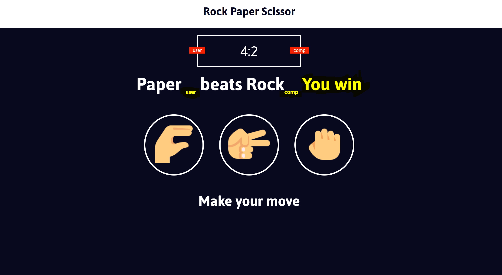
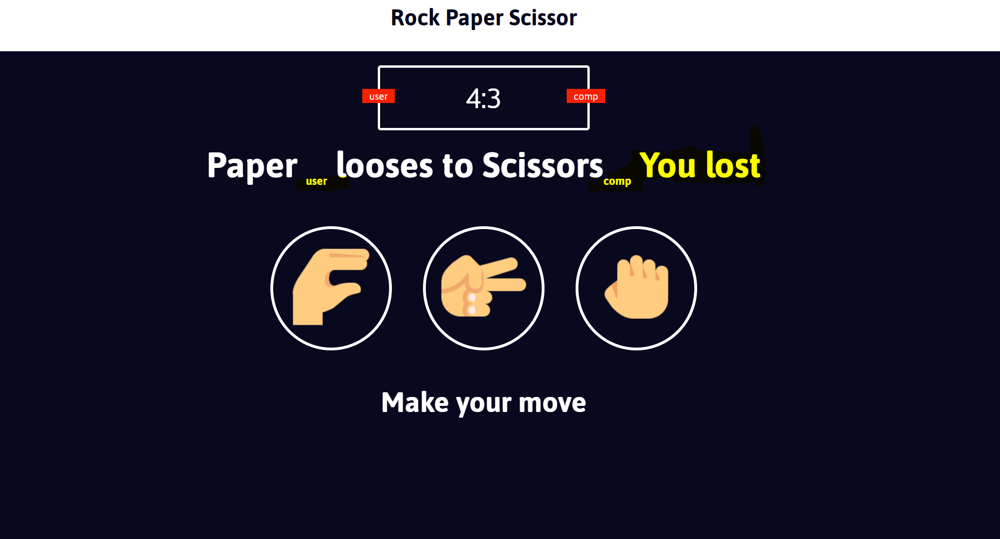
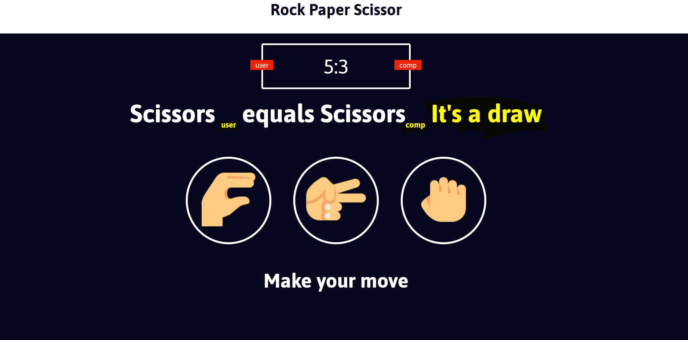

## Rock Paper Scissor web game against the computer.

Details of the Website :
1. The website has been designed using JavaScript, HTML, and CSS for the responsiveness and styling.
2. The opponent/computer response is generated randomly by picking up the option of rock paper scissors using math random function in JavaScript.
3. The score is recorded by the user until the user does not reload the page.

 

**Screenshot of the web-game**

1. **User winning the game and the score update.**

 

2. **User loosing the game and the score update.**

 

3. **User , computer draw the game and the score update.**

